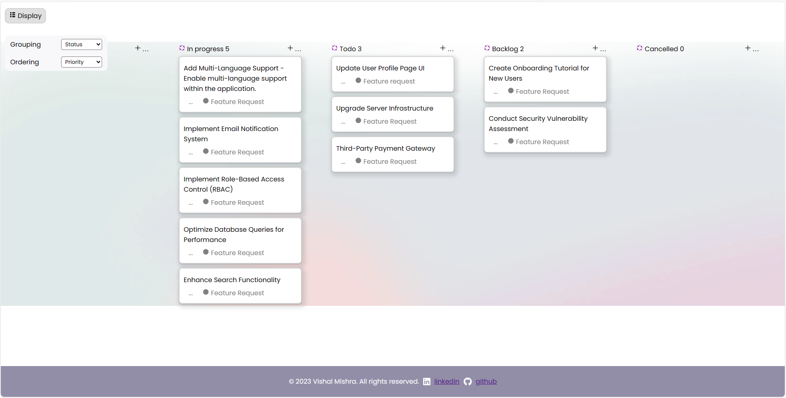
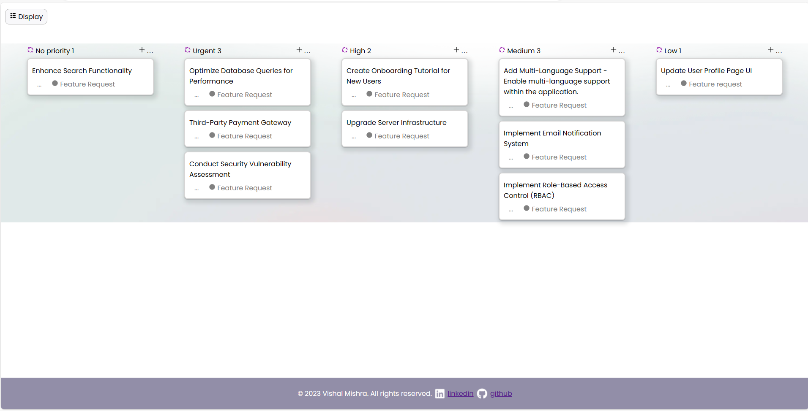

# QuickSell Project

The project is a web application developed using React.js. It fetches data from the QuickSell API to display and organize tickets based on different criteria such as status, user, and priority. The user can customize the display and order of the tickets. The application also includes features like a top navigation bar for customization, and a dashboard to view organized ticket data. The cards in the dashboard represent individual tickets with details like ID, title, tags, and status. The project aims to provide a user-friendly interface for managing and visualizing ticket data.

## Table of Contents

- [Introduction](#introduction)
- [Features](#features)
- [Project Structure](#project-structure)
- [Installation](#installation)
- [Usage](#usage)
- [Technologies Used](#technologies-used)
- [License](#license)
- [Author](#author)

## preview

remove header



## Introduction

The project is a React.js web application designed to fetch and display ticket data from the QuickSell API. Its primary purpose is to provide a user-friendly interface for organizing, customizing, and visualizing ticket information.
<br>
Key functionalities include:

Data Fetching: The application fetches ticket data from the QuickSell API using Axios, ensuring real-time and up-to-date information.

Dynamic Display: Users can customize the display of tickets based on different criteria such as status, user, and priority.

Sorting: The application allows sorting of tickets based on title and priority, providing flexibility in how the data is presented.

Top Navigation Bar: Users can access a top navigation bar to customize the grouping and ordering of tickets, providing a seamless and intuitive experience.

Dashboard: The dashboard presents organized ticket data, including details such as ID, title, tags, and status, in a visually appealing layout.

Card Representation: Individual cards represent each ticket, displaying relevant details and allowing for a quick overview.

## Features

The main features of the project include:

1. **Data Fetching:**
   - Utilizes the Axios library to fetch real-time ticket data from the QuickSell API.

2. **Dynamic Display:**
   - Allows users to dynamically group and display tickets based on different criteria, such as status, user, and priority.

3. **Sorting:**
   - Enables users to sort tickets based on title and priority for a customized viewing experience.

4. **Top Navigation Bar:**
   - Offers a top navigation bar that allows users to customize the grouping and ordering of tickets.

5. **Dashboard:**
   - Presents a visually organized dashboard displaying key details of the tickets, providing an intuitive overview.

6. **Card Representation:**
   - Utilizes individual cards to represent each ticket, displaying relevant information such as ID, title, tags, and status.

7. **Styling:**
   - Applies CSS styling to enhance the visual appeal of the application, making it user-friendly and aesthetically pleasing.

8. **Footer:**
   - Adds a footer section at the bottom of the page with copyright information, along with links to LinkedIn and GitHub.

9. **Hover Effect:**
    - Implements a hover effect on cards for an interactive and engaging user experience.

These features collectively contribute to a comprehensive and efficient ticket management system within the web application.


## Project Structure

The project follows a modular structure with well-organized folders and files. Here's an overview of the project structure:

### **1. Public:**
   - Contains static files that are publicly accessible.
   - Includes the main HTML file (`index.html`), favicon, and manifest.

### **2. Src:**
   - **Actions:**
      - `DataAction.js`: Handles asynchronous actions related to data fetching.

   - **Components:**
      - **Card:**
         - `Card.jsx`: Represents an individual ticket card.
         - `Card.css`: Styles for the card component.

      - **DashBoard:**
         - `DashView.jsx`: Displays tickets in a dashboard layout.
         - `DashView.css`: Styles for the dashboard component.

        - **TopNav:**
         - `TopNav.jsx`: Top navigation bar component.
         - `TopNav.css`: Styles for the top navigation component.

   - **Reducers:**
      - `DataReducer.js`: Manages state changes related to data fetching.
      - `SelectDataReducer.js`: Manages state changes for selected data.

   - **Store:**
      - `store.js`: Configures the Redux store.

   - **App.js:**
      - Main component orchestrating the application.

   - **Index.js:**
      - Renders the main React component into the root DOM element.

   - **App.css:**
      - Global styles for the application.

### **3. Package.json:**
   - Manages project dependencies and scripts.

### **4. Others:**
   - **Images:**
      - Includes images used in the project.

### **5. README.md:**
   - Provides documentation and information about the project.

### **6. .gitignore:**
   - Specifies files and directories to be ignored by version control.

### **7. Other Configuration Files:**
   - Various configuration files for tools or libraries used in the project.

This structured organization enhances maintainability and readability, making it easier for developers to navigate and understand the project.

## Installation

To install and run the project, follow these steps:

### **1. Prerequisites:**
   - Make sure you have Node.js and npm installed on your machine.

### **2. Clone the Repository:**
   ```bash
   git clone [repository_url]
   ```

### **3. Navigate to Project Directory:**
   ```bash
   cd [project_directory]
   ```

### **4. Install Dependencies:**
   ```bash
   npm install
   ```

### **5. Start the Development Server:**
   ```bash
   npm start
   ```

### **6. Open in Browser:**
   - Once the development server is running, open your browser and go to [http://localhost:3000/](http://localhost:3000/).

Now, you should have the project up and running on your local machine. The development server will provide live previews as you make changes to the code.

## Usage

### **Usage:**

This project serves as a web application created using React. Its primary purpose is to visualize and manage data fetched from the [QuickSell API](https://api.quicksell.co/v1/internal/frontend-assignment/). The key functionalities and features include:

1. **Dashboard View:**
   - Displays data categorized based on different parameters such as status, user, and priority.
   - Provides a clear representation of tickets and their details.

2. **Top Navigation:**
   - Allows users to choose the grouping and ordering criteria for the displayed data.

3. **Card Component:**
   - Represents individual tickets with essential information.
   - Tags and priority are visualized for each ticket.


### **Key Features:**

- **Dynamic Data Display:**
  - The application dynamically fetches data from the QuickSell API and displays it in an organized manner.

- **Grouping and Ordering:**
  - Users can customize how data is grouped and ordered, enhancing the user experience.

- **Responsive Design:**
  - The application is designed to be responsive, ensuring a seamless experience across different devices.

- **Visual Representation:**
  - Cards and components are designed for clear and intuitive visualization of ticket details.

### **Project Structure:**

The project is structured with different components, actions, reducers, and styles organized in their respective folders. The `src` folder includes subfolders like `actions`, `components`, `reducers`, and `styles`. The Redux state management library is utilized to handle application state efficiently.

### **Usage:**

Once installed, the application can be accessed in a web browser by navigating to [http://localhost:3000/](http://localhost:3000/). Explore the dashboard, try different grouping and ordering options, and experience the dynamic data visualization.

Now, if you have any specific questions or if there's anything else you'd like to know, feel free to ask!

## Technologies Used

- React
- Redux
- Axios
- React-icons

## Author

- Vishal Mishra
- Contact: ncepvishal@gmail.com 
- LinkedIn: https://www.linkedin.com/in/vishalmishra01


